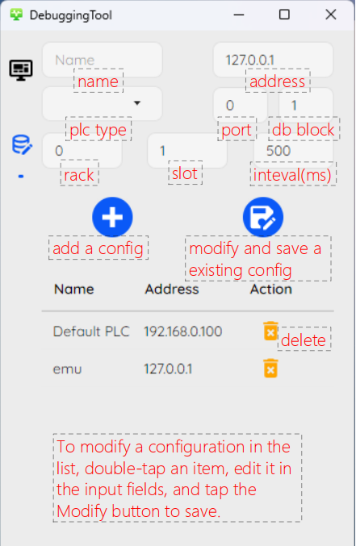
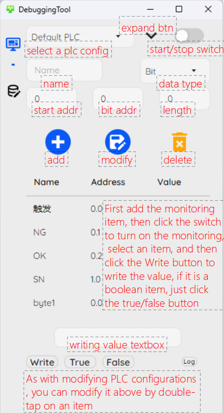

# DebuggingTool

A simple Siemens PLC monitoring tool, support desktop and Android, implemented using Avalonia and Sukiui.

## Getting Started

Follow these steps to get your project up and running.

### Prerequisites

- [.NET SDK](https://dotnet.microsoft.com/download)
- [Visual Studio](https://visualstudio.microsoft.com/vs/) or [Visual Studio Code](https://code.visualstudio.com/)

### Installation

1. **Clone the repository:**

    ```bash
    git clone https://github.com/louhuahua/DebuggingTool.git
    or
    git clone https://gitee.com/qop_1/debugging-tool.git
    ```

2. **Restore workload:**

    ```bash
    dotnet workload restore
    ```

### How to use

1. **Add a plc configuration:**

     

2. **Add monitor items and start monitoring:**

     